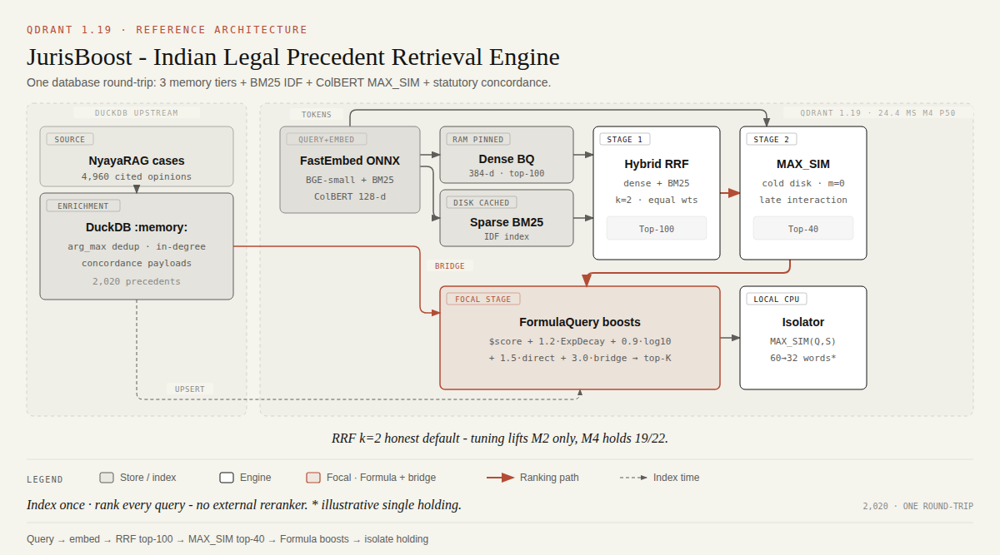
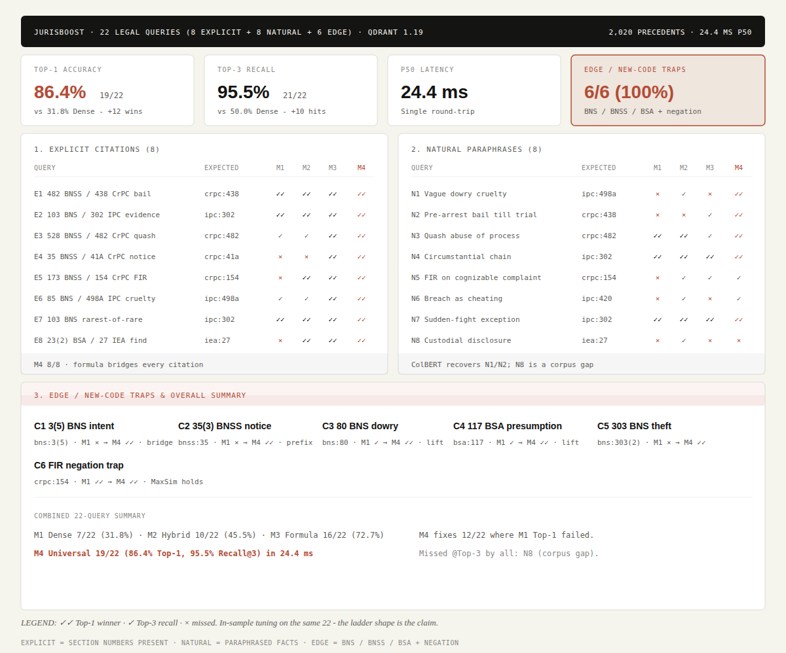
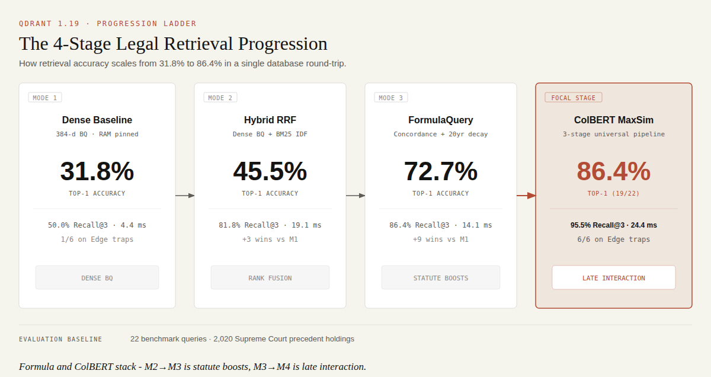

# JurisBoost: Indian Legal Precedent Retrieval

[](https://qdrant.tech)
[](https://python.org)
[](https://github.com/qdrant/fastembed)
[](../LICENSE)

A tutorial demo of **Qdrant 1.19** on real Supreme Court of India data (**NyayaRAG**: 4,960 source judgments → 9,337 cited precedents after DuckDB dedup → **2,034** criminal-filtered points). Each ladder mode is a **single `client.query_points` round-trip**. No external reranker.

> **19/22 Top-1 (86.4%) · 21/22 Recall@3 (95.5%)**. Dense alone is 7/22. Ladder: Hybrid RRF, then Formula, then ColBERT.

---

## 1. Architecture - one round-trip, three stages



**Upstream (DuckDB `:memory:`):** `arg_max(title, len)` + `count(DISTINCT source_case_id)` deduplicates cited precedents, builds citation in-degree, extracts statutes, and writes dual payloads `legal_references: [crpc:438]` + `mapped_references: [bnss:482]` (IPC/CrPC/IEA → BNS/BNSS/BSA).

| Vector / store | Representation | Memory | Why |
|---|---|---|---|
| **Dense 384-d** (BGE-small) | Cosine + 1-bit BQ | `CACHED` vectors, BQ `PINNED` | Sub-5 ms prefetch. `rescore=False` on the M4 dense leg (ColBERT rescores) |
| **Sparse BM25** | `Qdrant/bm25` (Modifier.IDF) | `CACHED` (`SparseIndexParams`, 1.19 tier) | Lexical hits on exact section numbers |
| **ColBERT 128-d** | MAX_SIM multi-vector (`m=0`) | `COLD` disk | Late interaction on the top-40 only - no HNSW |
| **Payload indexes** | Keyword (`prefix=True`) + Datetime + Integer | `PINNED` (explicit) | Statute lookup, `ExpDecay(judgment_date)`, `log10(source_case_count)` |

**Downstream (local CPU):** a ColBERT sentence isolator splits holdings (protecting `Sec./CrPC/Ors.`), embeds each sentence, and keeps `MAX_SIM(Q, Sent)` - **60 → 32 words (46.7% cut)** with zero LLM calls.

---

## 2. Query pipeline - `prefetch: Hybrid RRF → ColBERT → Formula`

This is the real M4 call (see `src/qdrant_ops.py` → `search_universal_pipeline` + `build_statutory_formula_query`). M1–M3 are prefixes of the same stack:

```python
client.query_points(
    collection_name="nyayarag_legal_precedents",
    prefetch=[
        models.Prefetch(
            query=[list(v) for v in colbert_query_matrix],
            using="colbert",
            limit=40,
            prefetch=models.Prefetch(
                query=models.FusionQuery(fusion=models.Fusion.RRF),
                prefetch=[
                    models.Prefetch(
                        query=dense_vector,
                        using="dense",
                        limit=100,
                        params=models.SearchParams(
                            quantization=models.QuantizationSearchParams(
                                rescore=False  # ColBERT rescores - skip FP32 fetch
                            ),
                        ),
                    ),
                    models.Prefetch(
                        query=models.Document(text=query_text, model="Qdrant/bm25"),
                        using="bm25",
                        limit=100,
                    ),
                ],
                limit=100,
            ),
        )
    ],
    # One MultExpression per resolved statute (see build_statutory_formula_query):
    #   direct hit  → 0.25 × domain on legal_references
    #   bridge hit  → 0.50 × domain on mapped_references
    query=models.FormulaQuery(
        formula=models.SumExpression(
            sum=[
                models.MultExpression(mult=[1.0, "$score"]),
                models.MultExpression(
                    mult=[
                        0.20 * 6.0,
                        models.ExpDecayExpression(
                            exp_decay=models.DecayParamsExpression(
                                x=models.DatetimeKeyExpression(
                                    datetime_key="judgment_date"
                                ),
                                target=models.DatetimeExpression(
                                    datetime="2026-09-03T00:00:00Z"
                                ),
                                scale=86400 * 365 * 20,
                                midpoint=0.5,
                            )
                        ),
                    ]
                ),
                models.MultExpression(
                    mult=[
                        0.15 * 6.0,
                        models.Log10Expression(
                            log10=models.SumExpression(
                                sum=["source_case_count", 1.0]
                            )
                        ),
                    ]
                ),
                # + per-statute terms, e.g.:
                # models.MultExpression(mult=[
                #     models.FieldCondition(
                #         key="legal_references",
                #         match=models.MatchValue(value="crpc:438"),
                #     ),
                #     0.25 * 6.0,
                # ]),
            ]
        ),
        defaults={"source_case_count": 0.0, "judgment_date": "2000-01-01T00:00:00Z"},
    ),
    limit=3,
)
```

| Mode | What it adds | Why it exists |
|---|---|---|
| **M1 Dense BQ** | Baseline semantic | Fast, and wrong on new-code / citation queries |
| **M2 Hybrid RRF** | + BM25, fused with RRF at the **top-level query** (canonical hybrid - not a second RRF wrap) | Section numbers become first-class |
| **M3 Hybrid → Formula** | Same RRF prefetch, then the **same** `FormulaQuery` M4 uses (`domain=6.0`) | Recency, citation authority, IPC↔BNS concordance |
| **M4 RRF → ColBERT → Formula** | ColBERT MAX_SIM on the top-40, then that same formula | Recovers paraphrased / natural-language queries |

> **RRF, not DBSF.** Rank fusion is the default when BM25 and cosine are incomparable. `k=2`, equal weights. Sweeping `k` or BM25-heavy weights lifts M2 but not M4 - ColBERT + Formula already compensate. See §6.

---

## 3. Benchmark - 22 queries, 3 tiers



* **Explicit (8):** section numbers present, BM25 can fire.
* **Natural (8):** paraphrased facts, no section number.
* **Edge (6):** pure BNS/BNSS/BSA, prefix ambiguity, negation.

| Evaluation tier | n | M1 Dense | M2 Hybrid RRF | M3 Hybrid → Formula | M4 RRF → ColBERT → Formula |
|---|:---:|:---:|:---:|:---:|:---:|
| **Explicit citations** | 8 | 3/8 (37.5%) | 5/8 (62.5%) | **8/8 (100%)** | **8/8 (100%)** |
| **Natural language** | 8 | 3/8 (37.5%) | 3/8 (37.5%) | 2/8 (25.0%) | **5/8 (62.5%)** |
| **Edge / new-code traps** | 6 | 1/6 (16.7%) | 2/6 (33.3%) | **6/6 (100%)** | **6/6 (100%)** |
| **Combined Top-1** | **22** | **7/22 (31.8%)** | **10/22 (45.5%)** | **16/22 (72.7%)** | **19/22 (86.4%)** |
| **Combined Recall@3** | **22** | 12/22 (54.5%) | 18/22 (81.8%) | 19/22 (86.4%) | **21/22 (95.5%)** |
| **p50 latency** | **22** | **2.4 ms** | **8.8 ms** | **7.5 ms** | **13.2 ms** |

M3 and M4 share the formula, so the M2→M3 jump is *formula*, and the M3→M4 jump is *ColBERT*. Formula alone can over-boost statutes on paraphrased queries (natural Top-1 dips 3/8 → 2/8); ColBERT recovers them.

Only `N8` (custodial disclosure 27 / 23(2)) is missed @Top-3 by every mode - corpus gap, not ranking.

---

## 4. Search ladder & sentence isolation



Default demo query (E1: anticipatory bail under 482 BNSS / 438 CrPC): M1 ranks `Siddharam Satlingappa Mhetre` (2010); M2 onward ranks `Sushila Aggarwal 2020`. Local ColBERT MaxSim isolates the holding (*"The court held that the protection granted to a person under Section 438 CrPC should not be limited to a fixed period, and it can continue till the end of the trial."*) - **60 → 32 words (46.7%)**.

---

## 5. Qdrant 1.19 analytics

* **`client.facet`** on `legal_references` - live counts across 2,034 precedents. Raw top includes noisy `section:*` keys (e.g. `section:3` at 150) where the 80-char act window missed; the showcase filters to canonical `act:section` keys (`ipc:302` is the real top at 296).
* **`query_points_groups(group_by="legal_references")`** - dense query, balanced precedent sets per statute in one round-trip.

Discover / Recommend / Context are out of scope for `fact → precedent` on this corpus. The demo query is solved by hybrid + formula (Sushila over Siddharam), not by a recommendation API. See [Search Strategies](https://skills.qdrant.tech/qdrant-search-quality/search-strategies/SKILL.md) for when those APIs help.

---

## 6. Research sweep

`uv run python scripts/research_tuning.py` (same 22 queries):

**RRF `k` (M2 Top-1):** k=2 → 10/22; k=10 → 14/22. M4 stays 19/22.

**Weighted RRF:** `[0.6, 1.4]` (BM25-heavy) → 15/22 M2. M4 still 19/22.

**BM25 `avg_len`:** 40 / 150 / 256 / 366 → no delta. Keep model defaults.

**Formula `domain_boost` (M4 Top-1):** 1.0 → 13/22; **6.0 → 19/22**; 9.0 → 18/22.

We keep `k=2`, equal weights, `domain=6.0`.

---

## 7. Quickstart

Both demos talk to `localhost:6333`. If GeoSmart already started Qdrant, skip compose - collection names do not collide.

```bash
cd 01-jurisboost-legal-ranking

# 1. Qdrant 1.19 (skip if something healthy is already on :6333)
docker compose up -d

# 2. Python env (CPU by default; CUDA is optional)
uv sync
# uv sync --extra gpu   # only if you have CUDA + want onnxruntime-gpu

# 3. Dataset is auto-downloaded on first index; or:
uv run python scripts/download_data.py

# 4. Full showcase (ladder + analytics + 22-query benchmark)
uv run python main.py

# 5. One query / benchmark only / force re-index
uv run python main.py --query "Can anticipatory bail under Section 482 BNSS continue without a fixed time limit, as under Section 438 CrPC?"
uv run python main.py --benchmark
uv run python main.py --rebuild
```

First index embeds 2,034 precedents with BGE + ColBERT - a minute or so on GPU, longer on CPU. Later runs reuse the collection.

### Project layout

```
01-jurisboost-legal-ranking/
  main.py                 # CLI showcase
  docker-compose.yml      # Qdrant 1.19
  scripts/download_data.py
  scripts/research_tuning.py
  src/
    qdrant_ops.py         # collection + M1–M4 search
    duckdb_pipeline.py    # dedup + concordance payloads
    data.py               # IPC/CrPC/IEA ↔ BNS/BNSS/BSA map
    embedder.py           # BGE-small + ColBERT (CUDA if present)
    sentence_isolator.py  # local MaxSim holding extraction
    benchmark.py          # 22-query eval
```

---

## 8. Credits

Builds on **Akshay Kumar Sharma's** work:

* [How Qdrant Reduced RAG Token Costs by 67% with Native ColBERT Reranking](https://pub.towardsai.net/how-qdrant-reduced-rag-token-costs-by-67-with-native-colbert-reranking-98b4b4d4d553)
* [Base repo: Cappybara12/legal-rag](https://github.com/Cappybara12/legal-rag)

**From inspiration → adaptation** (contracts → precedents):

* MSA clause chunks → Supreme Court holdings (`title + ratio`); the one-clause-per-chunk rule becomes one-holding-per-point.
* `BQ PINNED + COLD ColBERT (m=0) + rescore=False` kept exactly - same single-round-trip economics.
* Sentence isolation kept, with legal-abbreviation guards (`Sec./CrPC/Ors.`) added for citations.
* New: IPC/CrPC/IEA ↔ BNS/BNSS/BSA concordance as `FormulaQuery` statute boosts, so 2024-code queries retrieve 1970s precedents.

**JurisBoost** adds the NyayaRAG corpus, a 75-section IPC/CrPC/IEA ↔ BNS/BNSS/BSA concordance map, three memory tiers, hybrid RRF + `FormulaQuery` (`domain=6.0`), and `facet` / `query_points_groups` analytics - all Qdrant-native.
