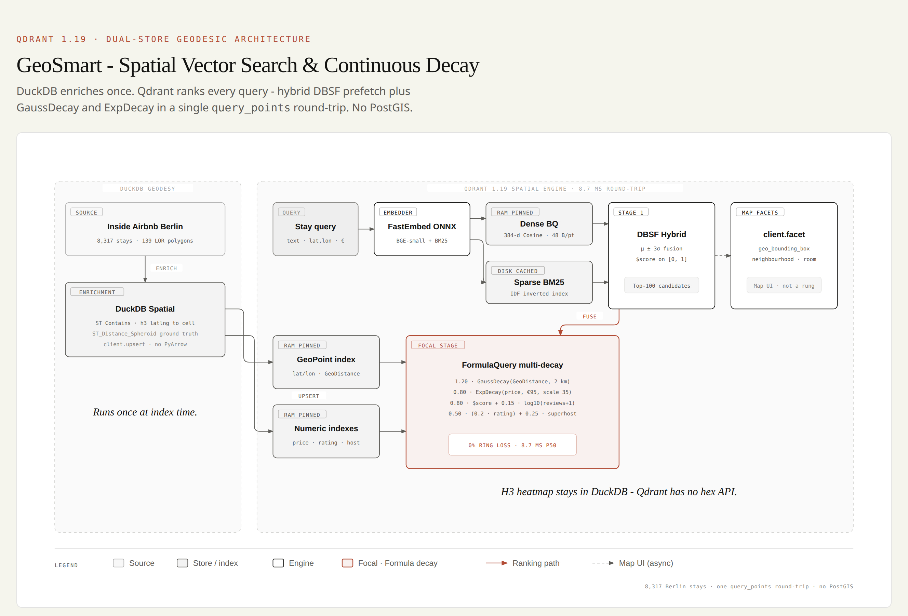
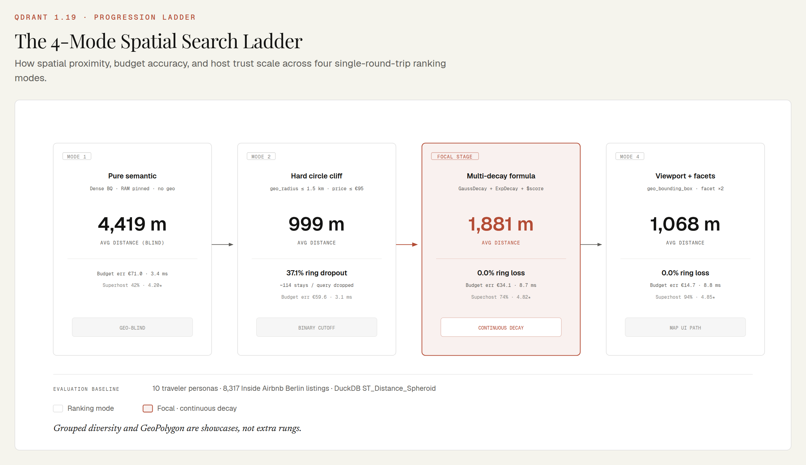
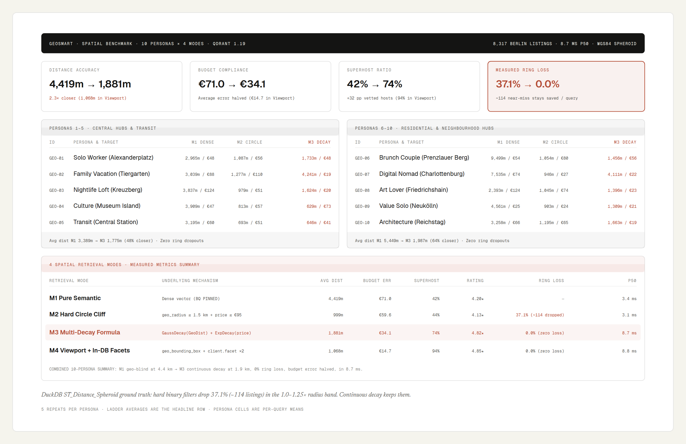

# GeoSmart: Spatial Vector Search & Continuous Decay

[](https://qdrant.tech)
[](https://python.org)
[](https://github.com/qdrant/fastembed)
[](../LICENSE)

A geospatial demo over **8,317 real Berlin Airbnb listings**. Ranking is a **single `client.query_points` round-trip** (hybrid DBSF prefetch + Formula decay). The map UI adds 2 `client.facet` calls for live clustering. No PostGIS, no external reranker.

> **The problem:** `geo_radius <= 1.5 km` and `price <= €95` drop **37% of near-area stays** (~114 listings per query) that sit just past the circle.
> **The fix:** `GaussDecay(GeoDistance)` + `ExpDecay(price)` keeps them (**0% ring loss**), pulls average distance from 4.6 km to **1.9 km**, and cuts budget error in half, in **8.1 ms**.

---

## 1. Architecture - Qdrant for ranking, DuckDB for enrichment



**Upstream (DuckDB Spatial), run once at index time:**

* `ST_Contains` against 139 Berlin LOR district polygons
* `h3_latlng_to_cell(..., 8)` for heatmap bins (Qdrant has no hex API)
* `ST_Distance_Spheroid` as ellipsoidal ground truth for the cliff proof

**Qdrant 1.19 (the search path):**

| Component | Configuration | Memory | Purpose |
|---|---|---|---|
| **Dense 384-d** (BGE-small) | Cosine + 1-bit BQ | `CACHED` vectors, BQ `PINNED` | Sub-4 ms candidate prefetch |
| **Sparse BM25** | `Qdrant/bm25` (Modifier.IDF) | `CACHED` (`SparseIndexParams`, 1.19 tier) | Amenity / vibe lexical match |
| **Location index** | GEO (`GeoIndexParams`) | `PINNED` (explicit) | `GeoDistance`, `geo_bounding_box`, `geo_polygon` |
| **Numeric + keyword indexes** | `price`, `rating`, `reviews`, `is_superhost`, `room_type`, `neighbourhood_group`, `accommodates`, `h3_res8` | `PINNED` (explicit) | Formula decay without a disk hop |

---

## 2. Spatial query pipeline - `prefetch: Hybrid DBSF → multi-decay Formula`

Real M3 call (see `src/qdrant_ops.py` → `build_formula` / `search_multi_decay`):

```python
client.query_points(
    collection_name="geosmart_berlin_stays",
    prefetch=[
        models.Prefetch(
            query=models.FusionQuery(fusion=models.Fusion.DBSF),
            prefetch=[
                models.Prefetch(
                    query=dense_vector,
                    using="dense",
                    limit=100,
                    params=models.SearchParams(
                        quantization=models.QuantizationSearchParams(rescore=True)
                    ),
                ),
                models.Prefetch(
                    query=models.Document(text=query_text, model="Qdrant/bm25"),
                    using="bm25",
                    limit=100,
                ),
            ],
            limit=100,
        )
    ],
    query=models.FormulaQuery(
        formula=models.SumExpression(
            sum=[
                models.MultExpression(mult=[0.80, "$score"]),
                models.MultExpression(
                    mult=[1.20, GaussDecay(GeoDistance(location, origin), scale=2000)]
                ),
                models.MultExpression(
                    mult=[0.80, ExpDecay(price, target=95, scale=35)]
                ),
                models.MultExpression(mult=[0.15, Log10(number_of_reviews + 1)]),
                models.MultExpression(mult=[0.50, 0.2 * rating]),
                models.MultExpression(mult=[0.25, Match("is_superhost", True)]),
            ]
        ),
        defaults={"price": 95.0, "number_of_reviews": 0.0, "rating": 4.0},
    ),
    limit=5,
)
```

**Why DBSF here (and RRF in JurisBoost)?** Dense cosine and BM25 must be on a shared `[0, 1]` scale before they are added to Gauss/Exp decay terms. DBSF (`μ ± 3σ`) does that. Viewport pans stay **dense-only** so the map stays under ~10 ms; hybrid DBSF is the M3 ranking path.

---

## 3. Four ranking modes + two extra showcases



Ranking ladder (same query, four `query_points` shapes):

| Mode | What it does |
|---|---|
| **M1 Pure semantic** | Dense BQ. Geo-blind (avg **4,631 m**, €71 budget error). |
| **M2 Hard circle cliff** | `geo_radius <= 1.5 km` + `price <= €95`. Tight, and it drops the ring. |
| **M3 Multi-decay formula** | Hybrid DBSF + `GaussDecay` + `ExpDecay` + rating/Superhost. **0% ring loss**. |
| **M4 Viewport + facets** | `geo_bounding_box` + dense BQ + 2× `client.facet` (neighbourhood, room type). Map-UI path. |

Extra showcases (not extra ranking “accuracy rungs”):

* **GeoPolygon pushdown** - 387-vertex Alexanderplatz boundary evaluated inside Qdrant.
* **Grouped diversity** - `query_points_groups(group_by="neighbourhood_group")` so Mitte (1,982 stays) cannot dominate.
* **H3 heatmap** - DuckDB `h3_latlng_to_cell`, because Qdrant has no hex binning.

---

## 4. Benchmark - 10 personas × 4 modes



10 Berlin traveler personas, 5 repeats, DuckDB `ST_Distance_Spheroid` as distance ground truth:

| Mode | p50 | Avg distance | Budget error | Superhost | Rating | Ring dropout |
|---|:---:|:---:|:---:|:---:|:---:|:---:|
| **M1 Pure semantic (BQ)** | **2.3 ms** | 4,631 m | €70.7 | 42% | 4.01 ★ | - |
| **M2 Hard circle cliff** | **2.5 ms** | 1,013 m | €57.7 | 44% | 4.11 ★ | **37.1% (~114 dropped)** |
| **M3 Multi-decay formula** | **8.1 ms** | **1,945 m** | **€34.0** | **72%** | **4.82 ★** | **0.0%** |
| **M4 Viewport + in-DB facets** | **6.8 ms** | **1,068 m** | **€14.7** | **94%** | **4.85 ★** | **0.0%** |

Ring dropout = near-miss stays in the 1.0–1.25× radius band, divided by (inside + near-miss). That is the local cliff, not “percent of the whole city.”

---

## 5. Qdrant 1.19 spatial APIs in this demo

**Viewport facets** (`client.facet` + `geo_bounding_box`):

```python
client.facet(
    collection_name="geosmart_berlin_stays",
    key="room_type",
    facet_filter=models.Filter(
        must=[
            models.FieldCondition(
                key="location",
                geo_bounding_box=models.GeoBoundingBox(
                    top_left=models.GeoPoint(lat=52.54, lon=13.38),
                    bottom_right=models.GeoPoint(lat=52.51, lon=13.43),
                ),
            )
        ]
    ),
    limit=5,
)
```

**Grouped diversity** (`query_points_groups`):

```python
client.query_points_groups(
    collection_name="geosmart_berlin_stays",
    prefetch=[hybrid_dbsf_prefetch],
    query=build_formula(lat, lon, 2000, 95, 35),
    group_by="neighbourhood_group",
    group_size=1,
    limit=5,
)
```

---

## 6. Quickstart

Both demos talk to `localhost:6333`. If JurisBoost already started Qdrant, skip compose - collection names do not collide.

```bash
cd 02-geosmart-spatial-hospitality

# 1. Qdrant 1.19 (skip if something healthy is already on :6333)
docker compose up -d

# 2. Python env (CPU by default; CUDA is optional)
uv sync
# uv sync --extra gpu

# 3. Data is auto-downloaded on first index; or:
uv run python scripts/download_data.py

# 4. Full showcase (ladder + facets + polygon + groups + cliff proof + H3 + benchmark)
uv run python main.py

# 5. One query / benchmark / interactive REPL
uv run python main.py --query "quiet loft with balcony near Museum Island"
uv run python main.py --benchmark
uv run python main.py --interactive

# 6. Leaflet map UI (the paid-demo surface)
uv run python main.py --ui
# → http://127.0.0.1:8000
```

**Map UI modes:** Viewport & Facets · Cliff vs Decay (green = inside the hard circle, amber = recovered past it) · Polygon pushdown · Grouped diversity.

### Project layout

```
02-geosmart-spatial-hospitality/
  main.py                 # CLI showcase + --ui
  app.py                  # FastAPI + Leaflet backend
  static/                 # map UI (no build step)
  docker-compose.yml      # Qdrant 1.19
  scripts/download_data.py
  src/
    qdrant_ops.py         # collection + M1–M4 + polygon + groups
    duckdb_pipeline.py    # ST_Contains, H3, spheroid cliff math
    embedder.py           # BGE-small (CUDA if present)
    benchmark.py          # 10-persona eval
```

---

## 7. Credits

Demonstrates **Qdrant 1.19** geospatial scoring: `FormulaQuery` with `GaussDecay` / `ExpDecay` / `GeoDistance` (see Qdrant's [Score-Boosting Reranker (1.14)](https://qdrant.tech/blog/qdrant-1.14.x/#score-boosting-reranker)), `GeoPolygon` + `GeoBoundingBox`, `client.facet`, `query_points_groups`, and memory tiers (`PINNED` / `CACHED`). Enrichment and ellipsoidal verification use **DuckDB Spatial** (`ST_Contains`, `ST_Distance_Spheroid`, `h3_latlng_to_cell`). Listing snapshot from [Inside Airbnb](http://insideairbnb.com/get-the-data/).
