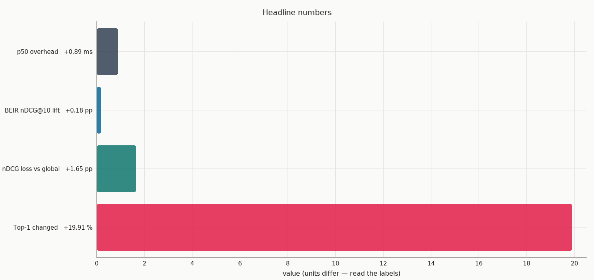

# Qdrant Demo Projects


A growing, runnable collection of **Qdrant demos, benchmarks, and tutorials.**
Each entry is self-contained in its own folder: its own `README.md`,
dependency manifest, and scripts, so you can copy one out or run the whole
collection without touching the rest.

No marketing numbers here: every claim is packaged with reproducible code,
a documented protocol, and the raw results to check it against.

## Contents

| Folder | What it demonstrates | Key result |
|---|---|---|
| [`per-tenant-idf/`](per-tenant-idf/) | **Per-tenant IDF:** the new `params.idf.corpus` in Qdrant 1.19, benchmarked on BEIR CQADupStack (12 forums, 457k docs, one sparse collection) | Per-tenant IDF reproduces a dedicated tenant BM25 collection (nDCG@10 ≈ 1.000); the default global IDF changes the #1 hit on **~20%** of queries |
| _more demos & tutorials coming_ | | |

[](per-tenant-idf/)

## How to use

```bash
# Qdrant (per-demo, optionally)
docker compose -f per-tenant-idf/docker-compose.yml up -d

# each demo is its own uv project
cd per-tenant-idf
uv sync
uv run python src/01_download_data.py
uv run python src/09_plot_results.py
```

See each entry's `README.md` for the full protocol and results.

## License

[MIT](LICENSE)
