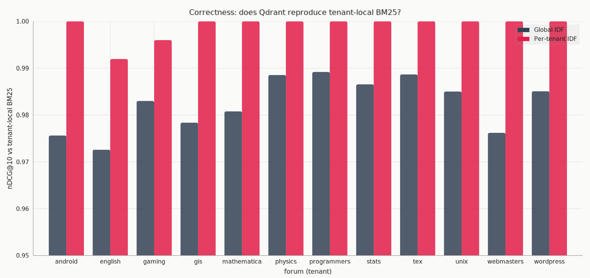
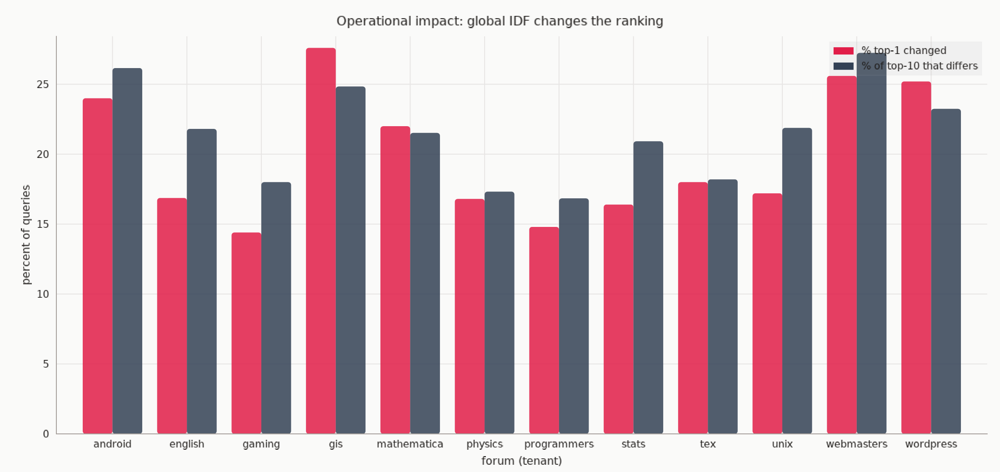
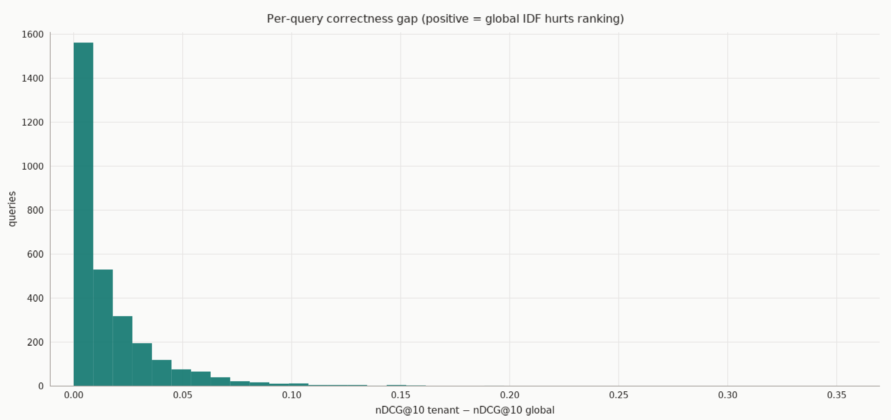
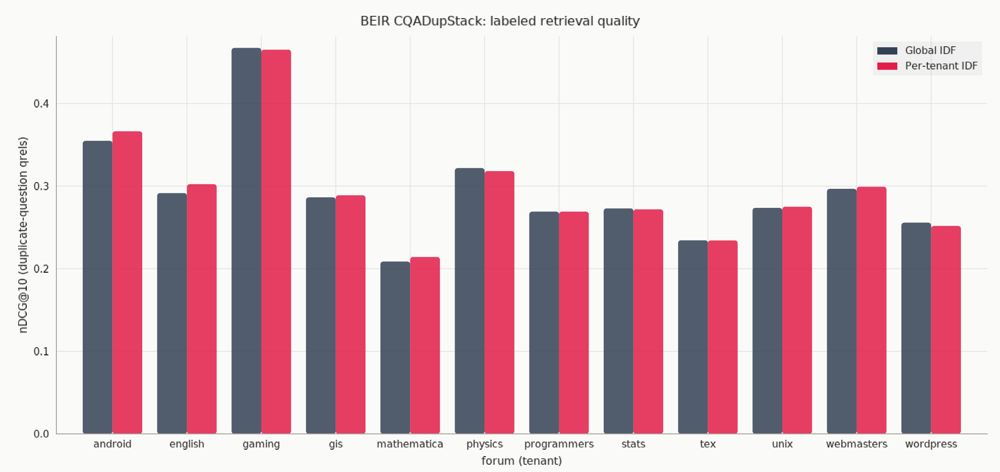
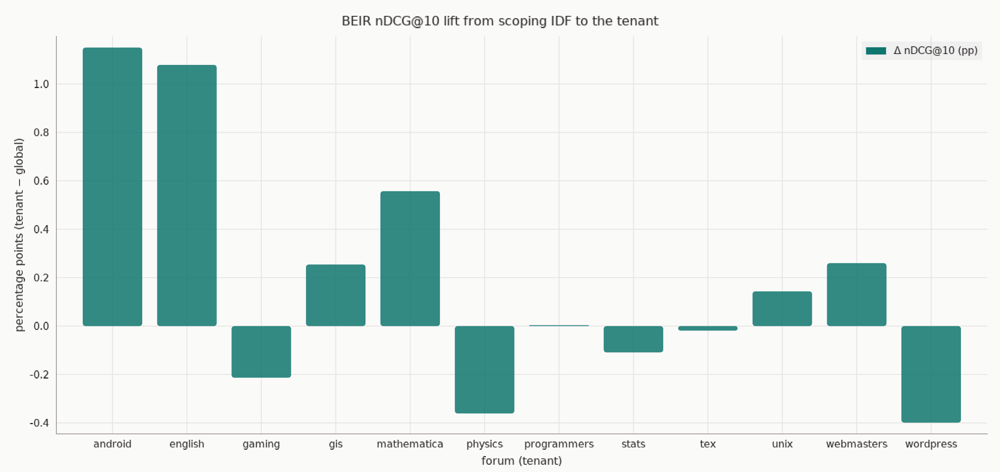
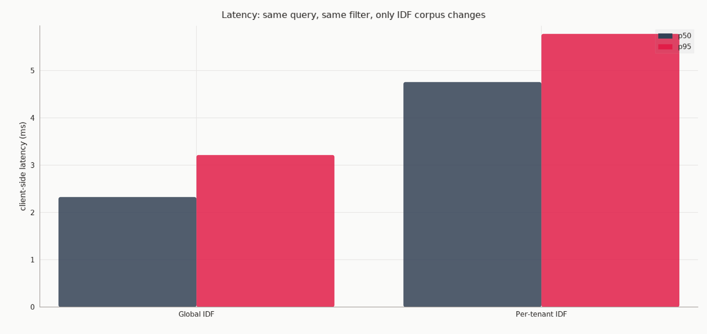
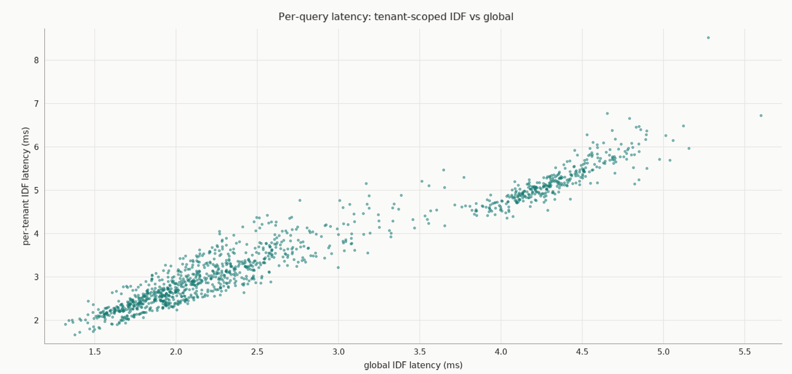

# Qdrant 1.19: Per-Tenant IDF Benchmark

> Part of the [Qdrant Demos & Benchmarks](../README.md) collection. All commands
> below are run from **this** folder (`per-tenant-idf/`).


-334155)

> **TL;DR:** Qdrant 1.19 lets you scope BM25 IDF statistics to a **single tenant**
> (`params.idf.corpus`). This benchmark asks one question:
> *does that reproduce the ranking you'd get if each tenant had its own collection?*
> **Yes. And with the default global IDF, the #1 result changes on about 1 query in 5.**
>
> On the full BEIR CQADupStack corpus (457k docs, **12 StackExchange forums** sharing
> one sparse collection):
>
> | Finding | Value |
> |---|---:|
> | Per-tenant IDF matches exact tenant-local BM25 | nDCG@10 ≈ **1.000** on 99.9% of 2,999 queries |
> | **Default global IDF changes the #1 hit** | **19.9%** of queries |
> | Cost of scoped statistics | **+0.89 ms p50** |
> | The BEIR duplicate-question nDCG lift | **~+0.2 pp**, a *scoring-correctness fix, not a leaderboard gain* |


## Contents

- [Why this exists](#why-this-exists)
- [Setup](#setup)
- [Methodology](#methodology)
- [Results](#results)
  - [Formula verification](#formula-verification-single-term-probe-tex-tenant)
  - [Correctness](#1-correctness-ndcg10-vs-ideal-tenant-local-bm25)
  - [BEIR labeled quality](#2-beir-labeled-quality-the-industry-standard-number)
  - [Latency](#latency-1200-queries--20-reps)
  - [Term-level distortion](#term-level-distortion)
  - [Edge cases](#edge-cases-as-documented)
- [Run it yourself](#run-it-yourself)
- [What this is (and is not)](#what-this-is-and-is-not)
- [Verdict](#verdict)

Validation of [Per-Tenant IDF Statistics](https://qdrant.tech/documentation/manage-data/multitenancy/#per-tenant-idf-statistics)
(`params.idf.corpus`, new in v1.19.0) on a single-node Docker instance.

## Why this exists

Most multi-tenant vector databases give you *payload isolation*: tenant A's query
never returns tenant B's documents. That is not what this benchmark is about.

The subtle failure is **statistics isolation**. BM25 quality depends on inverse
document frequency: *how rare is this term within the corpus it's scored
against?* With one shared collection, Qdrant's default IDF is computed over
**all 457k docs mixed across 12 forums**. A word like `android` is rare globally
but common inside its own forum, so global stats **overweight** it ~4.9× for that
tenant. Tenants that should behave like independent collections don't.

Can a small `params.idf` parameter fix that? This repo measures it.

The live collection is the **full official BEIR CQADupStack** corpus: 12 StackExchange
forums sharing one sparse BM25 collection. That is the multi-tenant setup the
feature is for: one collection, payload isolation, IDF that should not leak
across tenants.

## Setup

| Component | Value |
|---|---|
| Qdrant | `v1.19.0` via docker compose (single node, 1 shard) |
| Dataset | [BEIR CQADupStack](https://github.com/beir-cellar/beir), 457,199 docs, 13,145 labeled queries, 23,703 qrels |
| Tenants | 12 forums (`forum_tag`), 16.7k (mathematica) → 68.2k (tex) |
| Vectors | fastembed `Qdrant/bm25` sparse embeddings, `modifier=IDF` |
| Tenant index | keyword index on `forum_tag` with `is_tenant=true` |
| Python client | `qdrant-client` 1.19 `SearchParams.idf = IdfCorpusParams(corpus=Filter(...))` |

Two things are measured, and they answer different questions:

1. **Correctness:** does tenant-scoped IDF reproduce exact tenant-local BM25?
2. **BEIR quality:** on official duplicate-question labels, does the ranking
   actually get better? (nDCG@10 / MAP / Recall@100, macro-averaged over the
   12 forums, the protocol from [Thakur et al., 2021](https://openreview.net/forum?id=wCu6T5xFjeJ).)

## Methodology

Both modes always apply a **tenant payload filter**. The only difference is the
IDF corpus:

- **Mode A (default / global):** shard-wide IDF. `N = 457,199`, `df` mixed across all forums.
- **Mode B (1.19):** `SearchParams(idf=IdfCorpusParams(corpus=<tenant filter>))`.
  `N` and `df` are computed only on that forum.

Query vectors are identical. Sparse inverted-index retrieval is exact (no HNSW).

**Correctness ground truth** = Okapi BM25 scored in Python over that tenant's
stored sparse vectors, using tenant-local `(N, df)`:

```
IDF(q) = ln(1 + (N - df + 0.5) / (df + 0.5))
```

This is the formula Qdrant documents. nDCG@10 here is *agreement with that
ideal ranking*, not relevance.

**BEIR ground truth** = official duplicate-question qrels. Numeric ids collide
across forums, so qrels are assigned by walking the HuggingFace dump in
alphabetical forum order (recovers the published 23,703 judgments / 13,145
topics exactly).

```
# Mode A: global IDF (omit params.idf, or IdfScope.GLOBAL)
client.query_points(..., query_filter=tenant_filter)

# Mode B: per-tenant IDF
client.query_points(
    ...,
    query_filter=tenant_filter,
    search_params=models.SearchParams(
        idf=models.IdfCorpusParams(corpus=tenant_filter),
    ),
)
```

The IDF filter is independent of the retrieval filter. That is the documented
contract, and it is what we test.

## Results

### Formula verification (single-term probe, tex tenant)

Qdrant-implied IDF matches Okapi to 6 decimals in both modes:

```
global : N=457199 df=218876  -> implied 0.736613  predicted 0.736613
tenant : N=68184  df=42213   -> implied 0.479484  predicted 0.479485
```

### 1. Correctness (nDCG@10 vs ideal tenant-local BM25)

2,999 queries (250 per forum, BEIR query texts). Tenant-mode nDCG is 1.0000
on 2,996/2,999 queries; the three misses are short queries with 1 to 9 candidate
docs (ties or empty overlap), not IDF bugs.



| forum | queries | nDCG global | nDCG tenant | overlap@10 | top-1 changed |
|---|---:|---:|---:|---:|---:|
| tex | 250 | 0.9887 | 1.0000 | 0.818 | 18.0% |
| gaming | 250 | 0.9830 | 0.9960 | 0.820 | 14.4% |
| wordpress | 250 | 0.9851 | 1.0000 | 0.768 | 25.2% |
| english | 249 | 0.9726 | 0.9920 | 0.782 | 16.9% |
| unix | 250 | 0.9850 | 1.0000 | 0.781 | 17.2% |
| programmers | 250 | 0.9892 | 1.0000 | 0.832 | 14.8% |
| physics | 250 | 0.9885 | 1.0000 | 0.827 | 16.8% |
| gis | 250 | 0.9784 | 1.0000 | 0.752 | 27.6% |
| stats | 250 | 0.9866 | 1.0000 | 0.791 | 16.4% |
| mathematica | 250 | 0.9808 | 1.0000 | 0.785 | 22.0% |
| webmasters | 250 | 0.9762 | 1.0000 | 0.728 | 25.6% |
| android | 250 | 0.9756 | 1.0000 | 0.738 | 24.0% |
| **OVERALL** | **2999** | **0.9825** | **0.9990** | **0.785** | **19.9%** |

- Per-tenant IDF reproduces the theoretically-correct ranking.
- Global IDF: mean nDCG loss −1.65 pp. **Top-1 result changes on 19.9% of queries.**
- Tenant-mode better on 2,895 queries; global-mode better on **0**.





### 2. BEIR labeled quality (the industry-standard number)

Full official test set: **13,145 queries**, metrics as in BEIR
(nDCG@10, MAP, Recall@100). Macro-average = mean of the 12 forum scores
(how the CQADupStack number is reported on the BEIR leaderboard).

Published BM25 nDCG@10 on CQADupStack is **0.299**. Our FastEmbed BM25 lands
at **0.295**, same ballpark, same tokenizer family, so the pipeline is
calibrated against the public baseline.



| | nDCG@10 | MAP | R@10 | R@100 | MRR |
|---|---:|---:|---:|---:|---:|
| Global IDF (macro) | 0.2945 | 0.2676 | 0.3710 | 0.5667 | 0.2986 |
| Per-tenant IDF (macro) | **0.2964** | **0.2693** | **0.3740** | **0.5741** | **0.3000** |
| Global IDF (micro) | 0.2955 | 0.2680 | 0.3720 | 0.5621 | 0.2995 |
| Per-tenant IDF (micro) | **0.2973** | **0.2696** | **0.3751** | **0.5684** | **0.3008** |



- Mean labeled nDCG@10 lift is small: **+0.19 pp macro**. Android and english
  gain ~1 pp; gaming, physics, wordpress lose a fraction of a point.
- **Top-1 still changes on 18.5% of the 13,145 queries.** Duplicate-question
  labels are sparse (~1.8 relevants/query), so a different #1 often does not
  move nDCG much, but a user still sees a different first hit.
- The point is that per-tenant IDF makes BM25 *score correctly for that
  tenant*. It is not a large BEIR-leaderboard gain. The operational effect is
  the ranking change, not a labeled-nDCG delta.

### Latency (1,200 queries × 20 reps)



| mode | mean | p50 | p95 | p99 |
|---|---:|---:|---:|---:|
| global IDF | 2.77 ms | 2.33 ms | 4.76 ms | 5.34 ms |
| per-tenant IDF | 3.58 ms | 3.21 ms | 5.78 ms | 6.53 ms |

Overhead of scoped statistics: **+0.89 ms p50 (+38% relative), +1.02 ms p95**.
Absolute cost stays in the low milliseconds on 457k docs / 1 shard.



### Term-level distortion

Same word, wildly different rarity depending on corpus scope (457k mixed docs):

| term | forum | % of tenant docs | idf_global | idf_tenant | global vs tenant |
|---|---|---:|---:|---:|---|
| wordpress | wordpress | 41.0% | 3.063 | 0.893 | 3.4× overweighted globally |
| latex | tex | 28.9% | 3.124 | 1.240 | 2.5× overweighted globally |
| android | android | 47.9% | 3.579 | 0.736 | 4.9× overweighted globally |
| plugin | wordpress | 27.0% | 3.295 | 1.308 | 2.5× overweighted globally |
| kernel | unix | 7.8% | 4.371 | 2.548 | 1.7× overweighted globally |

Tenant-specific jargon (`natbib`, `fontspec`, `skyrim`, `lagrangian`) exists
*only* inside its tenant, yet global stats still misprice it because
`N_global` is 6.7× larger than the largest tenant.

### Edge cases (as documented)

1. `idf` param on a vector without the IDF modifier → rejected with HTTP 400.
2. Corpus filter matching zero points → every term gets a constant weight;
   two different empty corpora produce identical scores; rare-term doc dropped
   out of top-5.

## Run it yourself

The collection and embeddings are already built (457,199 points). `02_index_data.py`
**refuses to rebuild** if the count already matches, so you will not wipe the
index by accident.

```bash
docker compose up -d
uv sync
uv run python src/01_download_data.py     # BEIR corpus + queries + qrels
# uv run python src/02_index_data.py      # skipped if collection is already full
uv run python src/03_accuracy_benchmark.py
uv run python src/04_latency_benchmark.py
uv run python src/05_edge_cases.py
uv run python src/06_term_case_study.py
uv run python src/07_worst_case_replay.py
uv run python src/08_beir_eval.py         # official 13,145-query BEIR protocol
uv run python src/09_plot_results.py      # XY charts → figures/
```

Scripts import `common` from `src/`. From this folder:

```bash
PYTHONPATH=src uv run python src/08_beir_eval.py
```

> Note: `docker compose up -d` mounts `./qdrant_storage` relative to this file.
> If you see a `qdrant_storage/` directory at the **repo root** instead, that is
> the live Qdrant volume. It is gitignored, so after stopping the container you
> can move it here with `sudo mv qdrant_storage per-tenant-idf/`.

## What this is (and is not)

| Claim | Supported? |
|---|---|
| Per-tenant IDF implements the documented Okapi formula on a tenant subset | **Yes** (6-decimal match) |
| It reproduces dedicated-collection BM25 ranking inside a shared collection | **Yes** (nDCG ≈ 1.0 vs that ideal) |
| Global IDF changes the #1 hit on a large fraction of tenant-filtered queries | **Yes** (~20%) |
| Extra latency is small in absolute terms | **Yes** (~0.9 ms p50) |
| It produces a large BEIR nDCG@10 gain on CQADupStack | **No.** +0.2 pp. Report the ranking-change rate, not a large nDCG gain. |

The SDK surface used here (`IdfCorpusParams.corpus`, `IdfScope.GLOBAL`) matches
Qdrant 1.19 docs. No client-API update was required.

## Verdict

Per-tenant IDF does exactly what it claims: BM25 scoring within a tenant
becomes what you would get if that tenant had its own collection, at ~0.9 ms
p50 extra cost. On vocabulary-skewed multi-tenant data, default global
statistics change the #1 search result roughly every 5th query. Labeled
duplicate-question nDCG barely moves. The feature is a **scoring correctness
fix**, not a retrieval-quality trick.
